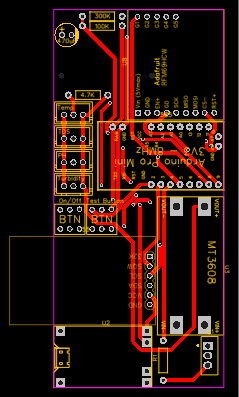

# Wasser Qualitäts Sensor - Doku/Kochbuch

# Arduino ProMini – Anschließen & Programmieren

Da für die Programmierung ein USB zu TTL Konverter benötigt wird, muss dieser zuvor verkabelt werden.
Arduino ProMini	USB zu TTL Konverter
 GND	GND
 RxD	TxD
 TxD	RxD
 VCC	nc
 
Das Anschließen von VCC ist nur Sinvoll sofern der TTL Konverter auf 3.3 V eingestellt ist und sich der Arduino nicht auf der Platine befindet bzw Schalter (B1 - BTN on/off) auf OFF steht. Zum Programmieren des Arduinos ist eine Stromversorgung durch den Akku sinnvoll und VCC des TTLs bleibt nicht verbunden.

# Die Programmierung des Sensors wird mithilfe der Arduino IDE durchgeführt.

Die dazu benötigten Biblioteken sind die folgenden:

[https://github.com/mcci-catena/arduino-lorawan](https://www.arduinolibraries.info/libraries/mcci-lo-ra-wan-lmic-library)
[https://github.com/rocketscream/Low-Power](https://www.arduinolibraries.info/libraries/low-power)
[https://www.arduinolibraries.info/libraries/one-wire](https://www.arduinolibraries.info/libraries/one-wire)
https://www.arduinolibraries.info/libraries/dallas-temperature

 
 
