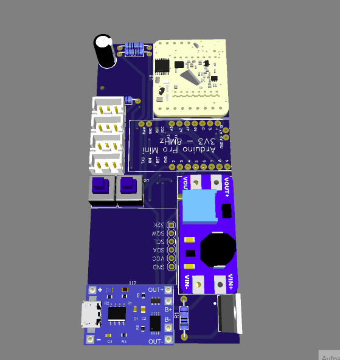

# Wasser Qualitäts Sensor - Doku/Kochbuch

# Arduino ProMini – Anschließen & Programmieren

Da für die Programmierung ein USB zu TTL Konverter benötigt wird, muss dieser zuvor verkabelt werden.
Arduino ProMini	USB zu TTL Konverter
 GND-GND
 RxD-TxD
 TxD-RxD
 VCC-nc
 
Das Anschließen von VCC ist nur sinnvoll sofern der TTL-Konverter auf 3.3 V eingestellt ist und sich der Arduino nicht auf der Platine befindet bzw Schalter (B1 - BTN on/off) auf OFF steht. Zum Programmieren des Arduinos ist eine Stromversorgung durch den Akku sinnvoll und VCC des TTLs bleibt nicht verbunden.

(Eine Programmierung über den USB-Anschluss des tp4056-Modules ist nicht möglich)

# Programmierung mithilfe der Arduino IDE.

Die dazu benötigten Bibliotheken sind die folgenden:

[https://github.com/mcci-catena/arduino-lorawan](https://www.arduinolibraries.info/libraries/mcci-lo-ra-wan-lmic-library)

Es sollte nicht vergessen werden die config Datei anzupassen 
Das Standard Verzeichnis lautet: C:\Users\Administrator\Documents\Arduino\libraries\MCCI_LoRaWAN_LMIC_library\project_config
Für Europa und das verwendete Lora module müssen folgende Einträge einkommentiert werden:

#define CFG_eu868 1

#define CFG_sx1276_radio 1

[https://github.com/rocketscream/Low-Power](https://www.arduinolibraries.info/libraries/low-power)

[https://www.arduinolibraries.info/libraries/one-wire](https://www.arduinolibraries.info/libraries/one-wire)

https://www.arduinolibraries.info/libraries/dallas-temperature

# WaterQualitySensor Schematik und verwendete Komponenten 
 

1.) Das TP4056-Module ermöglicht das Laden der verbauten Li-Ion-Akkus entweder per USB und einem Standard-Netzteil oder Powerbank oder über ein 6V Solar-Pannel, welches an X1 angeschlossen wird. Das Laden der Akkus ist in On-und Off-Position des Switches B1 möglich.

2.) Die Platine ist auf die Verwendung zweier 18650 Li-Ion-Akkus ausgelegt. Ein Betrieb mit anderen Akkus im Spannungsbereich von 3-4.2V ist ebenfalls möglich. Zudem können zusätzliche Akkus über den Konnektor X1 angeschlossen werden, um eine längere Laufzeit zu ermöglichen. Dabei ist zwingend auf korrekte Polarität beim Anschluss zu achten!

3.) Switch B1 dient zum Ein-und Ausschalten des Sensors. 

4.) Das Module MT3608 erhöht die variable Eingangsspannung der Li-Ion-Akkus auf 5V zur Versorgung der Sensoren mit einer konstanten Spannung. Die Spannung muss bei der ersten Benutzung via des Trimm-Pottentiomenters und einem Multimeter auf 5V eingestellt werden. 

5.) Mithilfe des NPN Mosfets Q1 kann die Stromversorgung der Sensoren und des LoraWan-Modules gesteuert werden. Nur wenn der Pin D4 des Arduinos auf HIGH gesetzt wird, werden die angeschlossenen Module mit Strom versorgt. Dadurch kann der Stromverbrauch optimiert werden. 
- Im Betrieb befindet sich der Arduino die meiste Zeit im deep-sleep und verbraucht ca. 30-40 μA.  
- Zum Messen und Senden der Werte sind die Module lediglich eine möglichst kurze Zeit aktiv.

6.) Switch B3 ist an einen der WakeUp-Pins des Arduinos angeschlossen. Er bietet die Möglichkeit eine beliebige Funktion des Arduions auszulösen, ohne diesen reseten zu müssen.

7.) U5, U6, U7 und U9 sind als JST XH2.54 3-Pin Stecker konzipiert und verhindern somit ein falsches Anschließen der Sensormodule. Das Pin-Mapping ist dabei systematisch wie folgt: VCC-P1 Value-P2 GND-P3 
- U5, U7 und U9 ermöglichen dabei das Anschließen eines beliebigen 5v Analog-Sensors.
- U6 ist in Verbindung mit R5 auf die Verwendung eines oder mehrerer 18b20 Temperatur-Sensors/en ausgelegt.
- Das RFM95W LoRa Radio Transceiver Module kommt als Sende-Module zum Einsatz. 
- Die Komponentengruppe C1, R2 und R3 ermöglichen es, dem Arduino die Spannung und somit die verbleibende Kapazität der Akkus zu messen. Da alle Akkus paralell geschalten sind, ist ihre Spannung identisch. Anhand des Spannungsverlaufs der verbauten Akkus lässt sich die Restkapazität berechnen. 